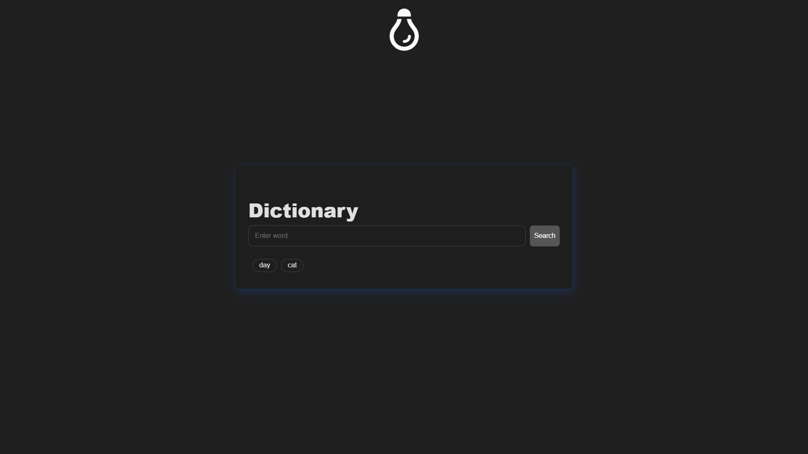
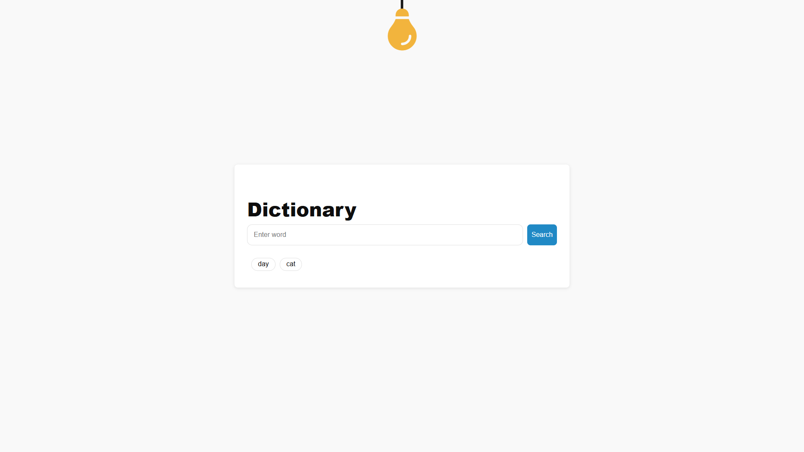

# 📚 Dictionary App

A responsive multilingual dictionary web app built using **TypeScript**, **HTML5**, and **CSS3**.  
Users can search for English words and view their definitions, phonetics, examples, and audio pronunciation — all fetched live from an open API.

---

## 🚀 Live Demo

📍 [View Live](https://codebyabdo.github.io/Dictionary-App/)

---

## 📸 Screenshots

| Home Page | Projects Section |
|-----------|------------------|
|  |  |

<!-- Replace with actual screenshots if available -->

---


## ✨ Features

- 🔍 Search for English words and get:
  - Definitions
  - Phonetics
  - Part of Speech
  - Usage Examples
- 🕘 History panel with clickable words
- 🌓 Light/Dark mode toggle
- 💾 Persistent word history using `localStorage`
- ❌ Error handling for not-found words

---

## 🛠 Tech Stack

- **TypeScript**
- **HTML5**
- **CSS3**
- **[Dictionary API](https://dictionaryapi.dev/)**

> 💡 No frameworks or build tools required. 100% lightweight and static.

---

## 📦 Getting Started

To run the project locally:

```bash
git clone https://github.com/codebyabdo/Dictionary-App.git
cd Dictionary-App
open index.html
```

Or just double-click `index.html` in your file manager.

---

## 📁 Project Structure

```
📦 Dictionary-App
┣ 📂 css
┃ ┗ 📜 style.css
┃ ┗ 📜 all.min.css
┃ ┗ 📜 normalize.css
┣ 📂 src
┃ ┣ 📜 main.ts
┃ ┗ 📜 types.ts
┣ 📂 dist
┃ ┗ 📜 main.js
┃ ┗ 📜 typs.js
┣ 📜 index.html

```

---

## 📄 License

This project is licensed under the [MIT License](./LICENSE).

---

## 🙋‍♂️ Author

- [Abd El-Rahman Adel](https://github.com/codebyabdo)
- [LinkedIn](https://www.linkedin.com/in/codebyabdo)

---

> ⭐ If you find this project useful, feel free to star the repo or use it as a template for your own apps.
